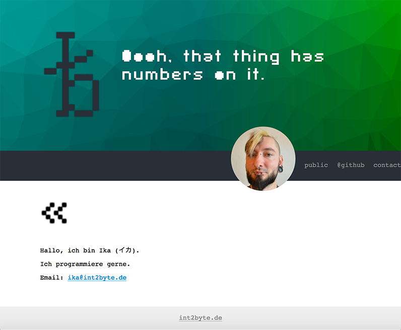

# twig-setup
My first running twig setup.

Please install the Twig templating framework after you downloaded this files, using your composer:

```
$ composer install
```




Font used for the headlines is [SF Pixelate](https://www.dafont.com/sf-pixelate.font "SF Pixelate").
