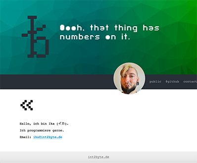

# twig-setup
My first running twig setup.

Please install the Twig templating framework after you downloaded this files, using your composer:

```
$ composer install
```




## Compress *.js and *.css files
Install the web builder (gulp):
```
$ npm install gulp
$ gulp install
```

Then run
```
$ gulp
```

This will write new files:
 * dist/core.min.js
 * dist/girih.min.js
 * dist/styles.min.css

And also place a copy of them into the public/ dir.


## The .env file
The environment configuration file contains the MODE element only:
 * MODE={DEVELOPMENT|PRODUCTION}

Depending on this values the templates use the uncompressed respective
the compressed scripts/styles.


### Credits
Font used for the headlines is [SF Pixelate](https://www.dafont.com/sf-pixelate.font "SF Pixelate").
